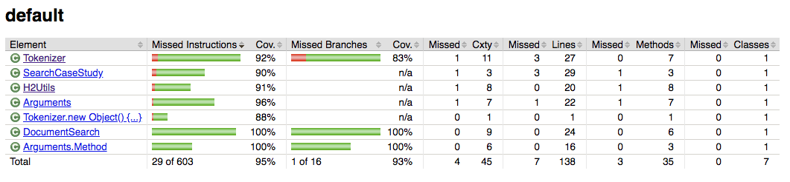

# document-search
Search for words (tokens) in text files

## Intellij setup
- Please install the intellij Lombok plugin for first class lombok support [https://plugins.jetbrains.com/plugin/6317-lombok-plugin]

## How to Build
- While in the search directory, run the command ``` ./mvnw clean install ``` 

## How to Run
- Run the command ``` java -jar <full path to jar> <full path to unzipped folder with txt files> ```
- You'll be prompted to enter a search term.  The search term can be one of the following
  1. A string with no quotes.  For example: ```the```
  2. A simple regex.  For example: ```/the|and/``` will search for both the tokens ```the``` and ```and```
  3. A compound token pattern.  For example ```[ !{ tag:/VB.*/ } ]``` will search for all tokens that are not verbs.  [ Documentation](https://nlp.stanford.edu/software/tokensregex.html)
- You'll be prompted to choose a search method.  Your choices are
  1.  String (basic string matching)
  2.  Regex (Necessary if your search term is a regex)
  3.  Indexed (The tokens are first indexed in an H2 database before being queried)

## Code Coverage Report
- First run ```./mvnw clean test``` then open the file search/target/site/jacoco/index.html in your browser of choice


## Assumptions
- Text files that you want to be analyzed end in a ```.txt``` extension

## Performance Testing
- To run performance tests, execute the following ```./mvnw -Dtest=TokenizerTest#performanceTest -DargLine="-Dsystem.performance.test=true" test```
- My last run returned the following result:

    ```
    \-------------------------------------------------------
     T E S T S
    \-------------------------------------------------------
    Running TokenizerTest
    SLF4J: Failed to load class "org.slf4j.impl.StaticLoggerBinder".
    SLF4J: Defaulting to no-operation (NOP) logger implementation
    SLF4J: See http://www.slf4j.org/codes.html#StaticLoggerBinder for further details.

    <----------------  Performance Testing Results ---------------->
    2,000,000 million searches with the String method took:    31,864 ms
    2,000,000 million searches with the Regex method took:  2,578,589 ms
    2,000,000 million searches with the Indexed method took:  28,5614 ms
    Tests run: 1, Failures: 0, Errors: 0, Skipped: 0, Time elapsed: 2,897.342 sec

    Results :

    Tests run: 1, Failures: 0, Errors: 0, Skipped: 0
    ```
- The fastest approach is the Indexed route with a database.  This is not surprising since pre-computing an index allows for fast lookups.
The string method is also not far behind only because I cache the results of tokenizing the file.  Without caching those results, the filesystem
would be hit on every search; causing a massive performance hit.
The surprising result to me is how long the Regex method took. Even with the caching of the tokens, the Regex method was 80 times as slow as the String method.
**Edit**
I noticed after the fact that I have a comma in the wrong position on the performance test result for the Indexed method.
Surprisingly, it actually took longer than the String method.  This changes everything about how I would actually scale an application to do this work.  I also wonder how well it would perform if I switch from using an in memory database, or if a different database table schema/indexes might help with tweaking performance.
The clear winner in my test is the String method.  Turning off caching of the file inputs would be an interesting test on how it performs.

## Scaling considerations
- Change from using H2 as a database to either a relational database, or a NOSQL database like DynamoDb.
- Separate the Loading of data into the database into its own separate and scalable process.
- Consider removing the ability to read from the filesystem directly.  If the filesystem is necessary, consider a distributed batch processing cluster like Apache Spark / HDFS.
- Add an api and an api (ex: nginx) in front of the application.  Allow input to be given in a better way than the console.
- The reading of files and processing of tokens is a highly parallelizable operation.  Take advantage of parallelism & concurrency to process large amounts of files.

## Library credits
- [Angel X. Chang and Christopher D. Manning. 2014. TokensRegex: Defining cascaded regular expressions over tokens. Stanford University Technical Report, 2014.](https://nlp.stanford.edu/pubs/tokensregex-tr-2014.bib)
- [Project Lombok](https://projectlombok.org/)
- [Vavr](http://www.vavr.io/)
- [Failsafe](https://github.com/jhalterman/failsafe)
- [Google Guava](https://github.com/google/guava)
- [JOpt Simple](https://pholser.github.io/jopt-simple/examples.html)
- [Jdbi 3](http://jdbi.org/)
- [H2 Database](http://www.h2database.com/html/main.html)

